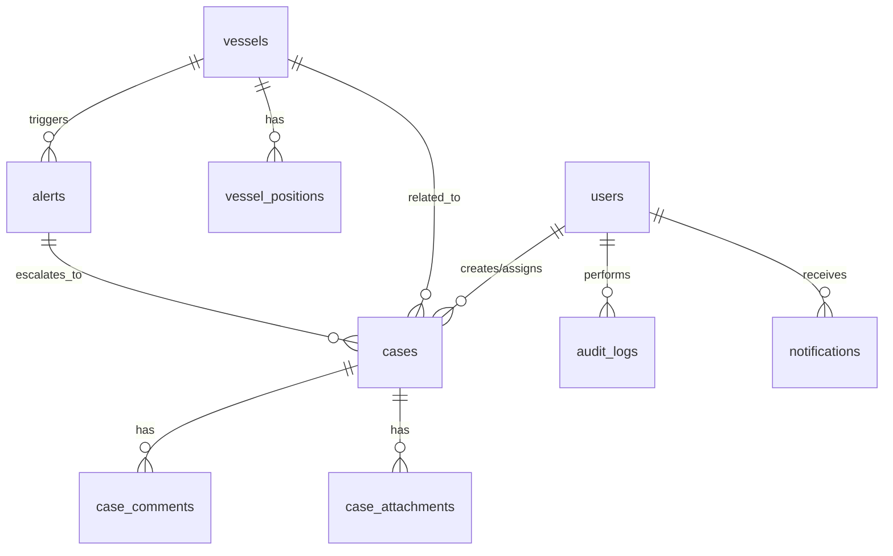

# 🗄️ Database Schema

> **Last Updated**: 2026-04-09  
> **Database**: PostgreSQL 16  
> **ORM**: TypeORM 0.3.x  
> **Naming**: snake_case tables & columns, UUID primary keys

---

## Entity Relationship Diagram



---

## Tables

### `users`

| Column | Type | Constraints | Notes |
|--------|------|-------------|-------|
| id | UUID | PK, DEFAULT gen_random_uuid() | |
| email | VARCHAR(255) | UNIQUE, NOT NULL | Lowercase, validated |
| password_hash | VARCHAR(255) | NOT NULL | Argon2id hash |
| full_name | VARCHAR(100) | NOT NULL | |
| role | ENUM('ADMIN','OPERATOR','ANALYST','VIEWER') | NOT NULL, DEFAULT 'VIEWER' | RBAC role |
| avatar_url | VARCHAR(500) | NULL | MinIO presigned URL |
| is_active | BOOLEAN | NOT NULL, DEFAULT true | Soft disable |
| last_login_at | TIMESTAMPTZ | NULL | |
| failed_login_attempts | SMALLINT | NOT NULL, DEFAULT 0 | Reset on success |
| locked_until | TIMESTAMPTZ | NULL | Account lockout |
| created_at | TIMESTAMPTZ | NOT NULL, DEFAULT NOW() | |
| updated_at | TIMESTAMPTZ | NOT NULL, DEFAULT NOW() | Auto-update trigger |

**Indexes:**
- `idx_users_email` — UNIQUE on `email`
- `idx_users_role` — B-tree on `role`

---

### `refresh_tokens`

| Column | Type | Constraints | Notes |
|--------|------|-------------|-------|
| id | UUID | PK | |
| user_id | UUID | FK → users.id, NOT NULL | ON DELETE CASCADE |
| token_hash | VARCHAR(255) | NOT NULL | SHA-256 hash of token |
| expires_at | TIMESTAMPTZ | NOT NULL | 7 days from creation |
| revoked | BOOLEAN | NOT NULL, DEFAULT false | |
| created_at | TIMESTAMPTZ | NOT NULL, DEFAULT NOW() | |
| user_agent | VARCHAR(500) | NULL | Browser/device info |
| ip_address | INET | NULL | |

**Indexes:**
- `idx_refresh_tokens_user_id` — B-tree on `user_id`
- `idx_refresh_tokens_hash` — B-tree on `token_hash`

---

### `vessels`

| Column | Type | Constraints | Notes |
|--------|------|-------------|-------|
| id | UUID | PK | |
| mmsi | VARCHAR(9) | UNIQUE, NOT NULL | Maritime Mobile Service Identity |
| imo | VARCHAR(7) | UNIQUE, NULL | International Maritime Organization number |
| name | VARCHAR(200) | NOT NULL | Vessel name |
| type | ENUM('Cargo','Tanker','Fishing','Passenger','Tug','Other') | NOT NULL | |
| flag | VARCHAR(3) | NOT NULL | ISO 3166-1 alpha-2 |
| flag_name | VARCHAR(100) | NULL | Full country name |
| callsign | VARCHAR(20) | NULL | |
| length | DECIMAL(8,2) | NULL | meters |
| width | DECIMAL(8,2) | NULL | meters |
| draught | DECIMAL(5,2) | NULL | meters |
| deadweight | INTEGER | NULL | tonnes |
| year_built | SMALLINT | NULL | |
| status | VARCHAR(50) | NOT NULL, DEFAULT 'Unknown' | e.g. Underway, Anchored, Moored |
| destination | VARCHAR(200) | NULL | Current destination port |
| eta | TIMESTAMPTZ | NULL | Estimated time of arrival |
| current_speed | DECIMAL(5,1) | NULL | knots |
| current_heading | DECIMAL(5,1) | NULL | degrees |
| current_lat | DECIMAL(10,7) | NULL | Last known latitude |
| current_lon | DECIMAL(11,7) | NULL | Last known longitude |
| last_ais_update | TIMESTAMPTZ | NULL | Last AIS signal |
| created_at | TIMESTAMPTZ | NOT NULL, DEFAULT NOW() | |
| updated_at | TIMESTAMPTZ | NOT NULL, DEFAULT NOW() | |

**Indexes:**
- `idx_vessels_mmsi` — UNIQUE on `mmsi`
- `idx_vessels_imo` — UNIQUE on `imo` (WHERE imo IS NOT NULL)
- `idx_vessels_type` — B-tree on `type`
- `idx_vessels_flag` — B-tree on `flag`
- `idx_vessels_name_trgm` — GIN trigram on `name` (for ILIKE search)
- `idx_vessels_position` — GIST on point(`current_lon`, `current_lat`) (spatial query)

---

### `vessel_positions`

> **Partitioned by**: `recorded_at` (monthly range partition)  
> **Retention**: 12 months rolling

| Column | Type | Constraints | Notes |
|--------|------|-------------|-------|
| id | BIGSERIAL | PK | Auto-increment for speed |
| vessel_id | UUID | FK → vessels.id, NOT NULL | |
| mmsi | VARCHAR(9) | NOT NULL | Denormalized for query speed |
| latitude | DECIMAL(10,7) | NOT NULL | |
| longitude | DECIMAL(11,7) | NOT NULL | |
| speed | DECIMAL(5,1) | NULL | knots |
| heading | DECIMAL(5,1) | NULL | degrees |
| course | DECIMAL(5,1) | NULL | Course over ground |
| status | VARCHAR(50) | NULL | Navigation status |
| recorded_at | TIMESTAMPTZ | NOT NULL | AIS signal timestamp |
| received_at | TIMESTAMPTZ | NOT NULL, DEFAULT NOW() | Server receive time |

**Indexes:**
- `idx_vp_vessel_recorded` — B-tree on `(vessel_id, recorded_at DESC)`
- `idx_vp_mmsi_recorded` — B-tree on `(mmsi, recorded_at DESC)`
- `idx_vp_recorded_at` — B-tree on `recorded_at` (partition key)

---

### `alerts`

| Column | Type | Constraints | Notes |
|--------|------|-------------|-------|
| id | UUID | PK | |
| vessel_id | UUID | FK → vessels.id, NULL | Can be non-vessel alert |
| type | ENUM('SPEED_ANOMALY','ROUTE_DEVIATION','ZONE_VIOLATION','AIS_GAP','SUSPICIOUS_BEHAVIOR','GEOFENCE','CUSTOM') | NOT NULL | |
| severity | ENUM('CRITICAL','HIGH','MEDIUM','LOW') | NOT NULL | |
| title | VARCHAR(200) | NOT NULL | |
| description | TEXT | NULL | |
| status | ENUM('NEW','ACKNOWLEDGED','INVESTIGATING','RESOLVED','DISMISSED') | NOT NULL, DEFAULT 'NEW' | |
| metadata | JSONB | NULL | Rule-specific data (speed, zone, coordinates) |
| acknowledged_by | UUID | FK → users.id, NULL | |
| acknowledged_at | TIMESTAMPTZ | NULL | |
| resolved_by | UUID | FK → users.id, NULL | |
| resolved_at | TIMESTAMPTZ | NULL | |
| latitude | DECIMAL(10,7) | NULL | Alert location |
| longitude | DECIMAL(11,7) | NULL | |
| created_at | TIMESTAMPTZ | NOT NULL, DEFAULT NOW() | |
| updated_at | TIMESTAMPTZ | NOT NULL, DEFAULT NOW() | |

**Indexes:**
- `idx_alerts_vessel_id` — B-tree on `vessel_id`
- `idx_alerts_status` — B-tree on `status`
- `idx_alerts_severity_created` — B-tree on `(severity, created_at DESC)`
- `idx_alerts_type` — B-tree on `type`

---

### `cases`

| Column | Type | Constraints | Notes |
|--------|------|-------------|-------|
| id | UUID | PK | |
| case_number | VARCHAR(20) | UNIQUE, NOT NULL | Auto-generated: `CS-YYYYMMDD-XXXX` |
| title | VARCHAR(200) | NOT NULL | |
| description | TEXT | NULL | |
| type | ENUM('INCIDENT','ANOMALY_FOLLOWUP','ROUTINE','PATROL','INSPECTION') | NOT NULL | |
| category | VARCHAR(100) | NULL | e.g. Collision, Piracy, Pollution |
| priority | ENUM('CRITICAL','HIGH','MEDIUM','LOW') | NOT NULL, DEFAULT 'MEDIUM' | |
| status | ENUM('OPEN','IN_PROGRESS','PENDING','RESOLVED','CLOSED') | NOT NULL, DEFAULT 'OPEN' | |
| created_by | UUID | FK → users.id, NOT NULL | |
| assigned_to | UUID | FK → users.id, NULL | |
| vessel_id | UUID | FK → vessels.id, NULL | Related vessel |
| alert_id | UUID | FK → alerts.id, NULL | Originated from alert |
| latitude | DECIMAL(10,7) | NULL | Incident location |
| longitude | DECIMAL(11,7) | NULL | |
| deadline | TIMESTAMPTZ | NULL | |
| resolved_at | TIMESTAMPTZ | NULL | |
| resolution_notes | TEXT | NULL | |
| created_at | TIMESTAMPTZ | NOT NULL, DEFAULT NOW() | |
| updated_at | TIMESTAMPTZ | NOT NULL, DEFAULT NOW() | |

**Indexes:**
- `idx_cases_case_number` — UNIQUE on `case_number`
- `idx_cases_status` — B-tree on `status`
- `idx_cases_assigned_to` — B-tree on `assigned_to`
- `idx_cases_priority_status` — B-tree on `(priority, status)`
- `idx_cases_created_by` — B-tree on `created_by`

---

### `case_comments`

| Column | Type | Constraints | Notes |
|--------|------|-------------|-------|
| id | UUID | PK | |
| case_id | UUID | FK → cases.id, NOT NULL | ON DELETE CASCADE |
| user_id | UUID | FK → users.id, NOT NULL | |
| content | TEXT | NOT NULL | Markdown-supported |
| created_at | TIMESTAMPTZ | NOT NULL, DEFAULT NOW() | |
| updated_at | TIMESTAMPTZ | NOT NULL, DEFAULT NOW() | |

---

### `case_attachments`

| Column | Type | Constraints | Notes |
|--------|------|-------------|-------|
| id | UUID | PK | |
| case_id | UUID | FK → cases.id, NOT NULL | ON DELETE CASCADE |
| uploaded_by | UUID | FK → users.id, NOT NULL | |
| file_name | VARCHAR(255) | NOT NULL | Original filename |
| file_key | VARCHAR(500) | NOT NULL | MinIO object key |
| file_size | BIGINT | NOT NULL | bytes |
| mime_type | VARCHAR(100) | NOT NULL | |
| bucket | VARCHAR(100) | NOT NULL, DEFAULT 'case-attachments' | MinIO bucket |
| created_at | TIMESTAMPTZ | NOT NULL, DEFAULT NOW() | |

---

### `audit_logs`

> **Purpose**: OWASP A09 compliance — track all sensitive operations

| Column | Type | Constraints | Notes |
|--------|------|-------------|-------|
| id | BIGSERIAL | PK | |
| user_id | UUID | FK → users.id, NULL | NULL for system actions |
| action | VARCHAR(100) | NOT NULL | e.g. `user.login`, `case.create`, `alert.acknowledge` |
| entity_type | VARCHAR(50) | NULL | e.g. `user`, `case`, `vessel` |
| entity_id | UUID | NULL | |
| metadata | JSONB | NULL | Request body, old/new values |
| ip_address | INET | NULL | |
| user_agent | VARCHAR(500) | NULL | |
| created_at | TIMESTAMPTZ | NOT NULL, DEFAULT NOW() | |

**Indexes:**
- `idx_audit_user_id` — B-tree on `user_id`
- `idx_audit_action` — B-tree on `action`
- `idx_audit_created_at` — B-tree on `created_at DESC`

---

### `notifications`

| Column | Type | Constraints | Notes |
|--------|------|-------------|-------|
| id | UUID | PK | |
| user_id | UUID | FK → users.id, NOT NULL | ON DELETE CASCADE |
| title | VARCHAR(200) | NOT NULL | |
| body | TEXT | NULL | |
| type | ENUM('ALERT','CASE','SYSTEM','INFO') | NOT NULL | |
| reference_type | VARCHAR(50) | NULL | e.g. `alert`, `case` |
| reference_id | UUID | NULL | Link to related entity |
| is_read | BOOLEAN | NOT NULL, DEFAULT false | |
| created_at | TIMESTAMPTZ | NOT NULL, DEFAULT NOW() | |

**Indexes:**
- `idx_notifications_user_unread` — B-tree on `(user_id, is_read)` WHERE `is_read = false`

---

## PostgreSQL Extensions Required

```sql
CREATE EXTENSION IF NOT EXISTS "uuid-ossp";     -- gen_random_uuid()
CREATE EXTENSION IF NOT EXISTS "pg_trgm";        -- Trigram search (vessel name ILIKE)
CREATE EXTENSION IF NOT EXISTS "postgis";        -- Spatial queries (optional, for future geo-fencing)
```

---

## Table Summary

| Table | Est. Rows (Year 1) | Partition | Notes |
|-------|---------------------|-----------|-------|
| users | < 1,000 | No | |
| refresh_tokens | < 10,000 | No | Cleanup cron |
| vessels | ~50,000 | No | |
| vessel_positions | ~500M+ | Monthly | Largest table — auto-vacuum tuned |
| alerts | ~100,000 | No | |
| cases | ~10,000 | No | |
| case_comments | ~50,000 | No | |
| case_attachments | ~20,000 | No | Files in MinIO |
| audit_logs | ~1M+ | No | Consider archival after 1yr |
| notifications | ~500,000 | No | Cleanup after read + 30 days |

---

*Document Version: 2.0*  
*Last Updated: 2026-04-09*
